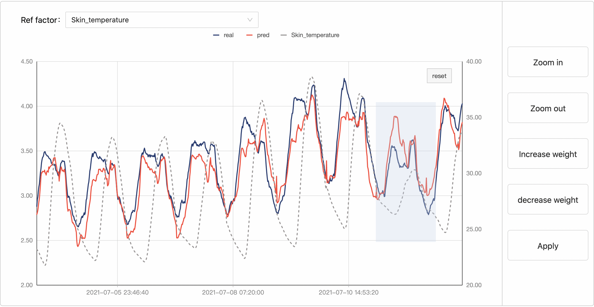
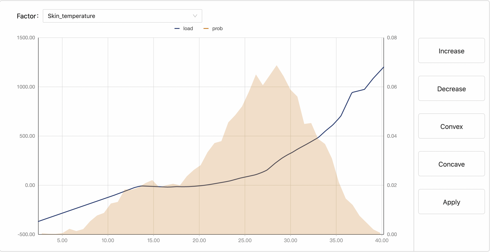

### Interactive GAM: An interactive and interpretable generalized additive model tool for electric load forecasting

Interactive generalized additive model (GAM) is an interpretable method which can incorporate specific domain knowledge in electric power industry for improved performance. Our method leverages piecewise linear functions and is optimized based on boosting framework. By utilizing the special structure of hinge functions and the boosting framework, our algorithm learns the interactive GAM model efficiently. Our interactive GAM outperforms current state-of-the-art GAMs and demonstrates good generalization ability in the cases of extreme weather events. To help the end users to use the model more easily, a user-friendly web-based tool is developed based on the interactive GAM. 

### Interactive GAM: An interpretable and editable tool for electric load forecasting

Interactive generalized additive model (GAM) is an interpretable method which can incorporate specific domain knowledge in electric power industry for improved performance. Our method leverages piecewise linear functions and is optimized based on boosting framework. By utilizing the special structure of hinge functions, the interactive GAM can be learned through our efficient algorithm. Our interactive GAM outperforms current state-of-the-art GAMs and demonstrates good generalization ability in the cases of extreme weather events. A user-friendly web-based tool is developed based on interactive GAM. We will upload our codes later.

#### Usage:

Requirements: see the requirements.txt

Install: (will complete later)

#### Train a GAM:

Replace the "data.csv" in ./data folder with your file (including the features and electric load) and rename it as "data.csv". Rename the label column in your data file as "load". Remove the columns that you don't want to use to learn the model. Switch the interactive page to "sample weight editing page" and press the "Apply" button. Then the interactive GAM model is automatically trained. Once the model is trained, the interface will display the prediction of the model on training data and the "shape function editing page" will be enabled.

#### Apply domain knowledge:

##### 1, Change the weight of training samples

Switch the interactive page to "sample weight editing page", and select the area you want to edit. Press "Increasing weight" or "Decreasing  weight" buttons on the right of page. System will record the times that you pressed the button. The sample weights are initilized as $1$. If you press the"Increasing weight" for $K$ times, then the weight of the samples in this area is set to $2^K$.  You can modify the sample weights according to the fitting error, or also can according to some reference factor, which can be selected in the "Ref factor" drop-down menu. After editing the weight, you can press "Apply" botton, then the model is retrained according to the new sample weights.

##### 2, Add constraints to the shape functions

Switch the interactive page to "shape function editing page", and select the area you want to edit. Press "Increase", "Decrese", "Convex" or "Concave" buttons on the right of page. One can select multiple ereas and apply different constraints. Once editing is complete, you can press "Apply" botton, then the model is update to fitting these constraints meanwhile to increase the fitting error as small as possible. We plot the sample density to help the user to estime how many samples will be affected due to the constraints applied.

